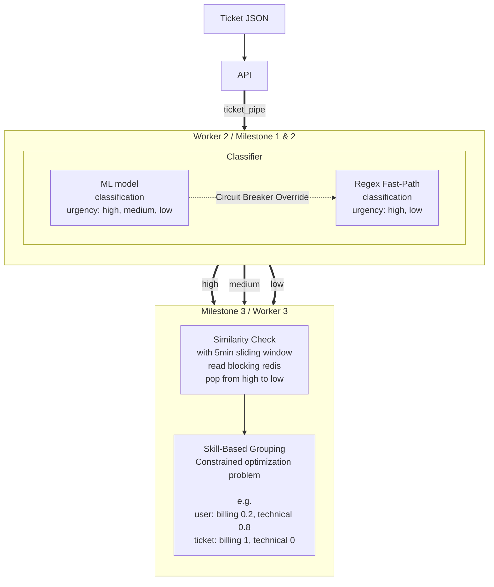

# Support Ticket AI Router

An intelligent, multi-stage support ticket routing system powered by Flask, Celery, Redis, MongoDB, and HuggingFace Transformers.

This project implements an autonomous three-stage pipeline to handle, classify, and intelligently route incoming support tickets based on semantic meaning, urgency, and agent skill sets.

## Architecture & Milestones

The system is built as a series of evolving milestones combined into a single robust pipeline.



### 1. Milestone 1: Baseline Router (Fast Path)
A synchronous, keyword-based classifier that acts as the initial fallback fast-path.
* **Mechanism:** Uses regex rules (e.g., `urgency`, `ASAP`, `billing`) to assign categories and an initial urgency score.
* **Fallback Role:** If the more complex machine learning models fail or time out, the system automatically degrades gracefully via a Circuit Breaker to use this M1 baseline so no tickets are dropped.

### 2. Milestone 2: Intelligent Queue Prioritization (Worker 1)
An async ML worker that analyzes text to dynamically rank queue priority.
* **Mechanism:** Uses a zero-shot HuggingFace Transformer (`typeform/distilbert-base-uncased-mnli`) to predict ticket categories (`Technical`, `Billing`, `Legal`) and calculate confidence.
* **Circuit Breaker:** Implements a robust `CircuitBreaker` pattern. If the ML inference times out or fails repeatedly, it opens the circuit and defers to the M1 Keyword fallback router.
* **Queuing:** Successfully processed tickets are pushed to specific Redis message queues (`high`, `medium`, `low`) based on their calculated urgency scores.

### 3. Milestone 3: Semantic Deduplication & Skill-Based Routing (Worker 2)
A secondary background worker performing heavy semantic lifting.
* **Blocking Reads:** Listens to the Redis queues utilizing a strict priority ordering strategy (`high`, `medium`, `low`).
* **Semantic Deduplication:** Generates embeddings for the ticket text using `all-MiniLM-L6-v2`. It continuously calculates the Cosine Similarity against a rolling 5-minute Redis window. If 10+ tickets match with >0.9 similarity, it suppresses them and escalates a Master Incident (Flash-Flood protection).
* **Skill-Based Routing:** Routes the deduplicated ticket to the active agent with the highest skill match score for the identified category. If multiple agents tie, it routes to the agent currently carrying the lowest active workload, tracking everything live in MongoDB.

---

## Deployment & Setup

This application is ready to be hosted on **Render** using the provided `render.yaml` blueprint. The Blueprint provisions:
1. **API Web Service** (Gunicorn / Flask)
2. **Worker M2** (Celery Zero-Shot Classifier)
3. **Worker M3** (Celery Embeddings & Router) 
4. **Vite React Frontend** (Static Site UI)
5. **Redis** (Task Broker & Key-Value state)

### Running Locally (Docker)

1. Start infrastructural dependencies (Redis & MongoDB):
```bash
docker compose up -d
```

2. Create a virtual environment and install backend dependencies:
```bash
python -m venv .venv
source .venv/bin/activate
pip install -r requirements.txt
```

3. Open three separate terminal tabs and start the services:
   * **API Service:** `python run.py`
   * **M2 Worker:** `python run_m2_worker.py`
   * **M3 Worker:** `python run_m3_worker.py`

### Running the Frontend locally (Optional)
The project includes a Vite + React frontend for a live view of the pipeline.

```bash
cd frontend
npm install
npm run dev
```

The frontend will run on `http://localhost:5173` and automatically connect to your local backend API.

---

## Testing via API

You can trigger a test ticket manually via `cURL`:

```bash
curl -X POST http://127.0.0.1:5100/tickets \
  -H "Content-Type: application/json" \
  -d '{"subject":"Database Crash", "body":"Our production DB01 instance is down, please fix ASAP!!", "customer":"admin@example.com"}'
```

_Note: If using Render, swap `http://127.0.0.1:5100` with your deployed Render URL._

